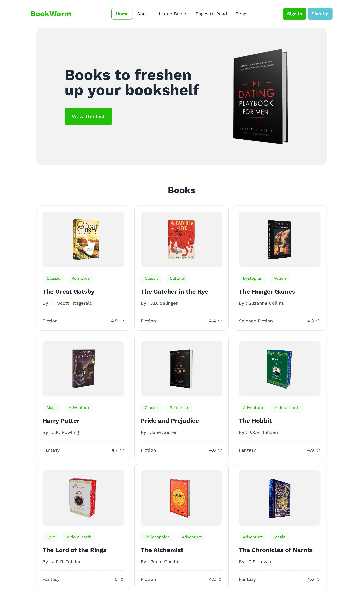
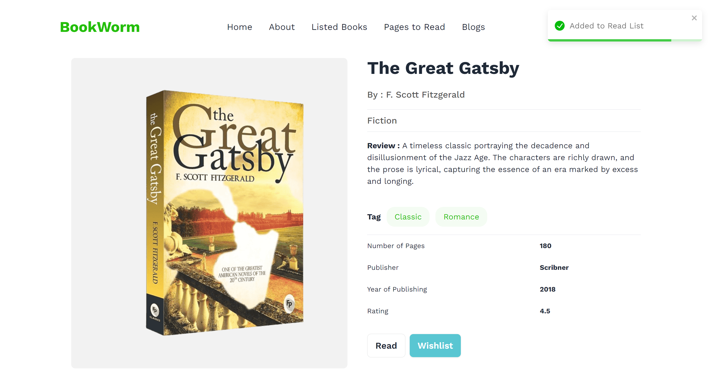
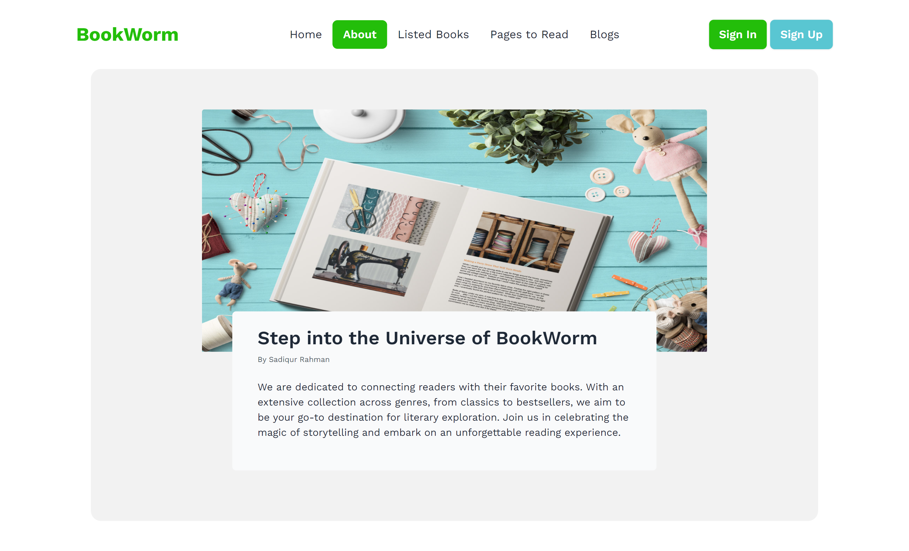
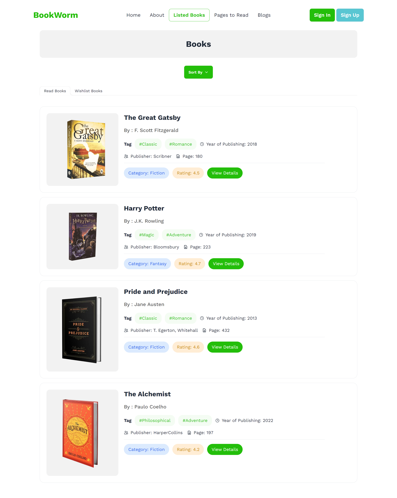
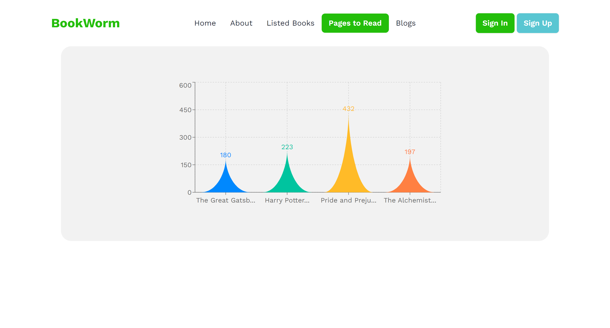

# Book Worm - React Project

## Project Overview

Book Worm is a user-friendly web application designed for book enthusiasts, offering a seamless experience for discovering, managing, and exploring literature. Built with React and Vite, it provides features such as book exploration, wishlist and reading list management, insightful blog content, and visual tracking of reading progress through interactive charts. With a responsive design, users can enjoy Book Worm's immersive experience across various devices.

#### Live Preview: [Click here](http://bookworms.surge.sh/)

## Technologies Used

- **React**
- **Vite**
- **Tailwind CSS**
- **Daisy UI**
- **Mamba UI**
- **Recharts**
- **React Icons**

## Pages

- **Home**: The landing page featuring a banner section and a Book section contains collection of books. Clicking on a book reveals its details.
- **About**: A page providing information about the application and its purpose.
- **Listed Books**: A page displaying a list of books, which are added by interacting with wishlist and read button from book details.
- **Pages to Read**: A page presenting a chart representing the number of pages of each book from read list.
- **Blogs**: A page showcasing various blogs related to books.

## Functionalities

- **Book Interaction**: Users can interact with books by adding them to their wishlist or read list.
- **Wishlist and Read List**: Users can manage their wishlist and read list, facilitating organization and planning of their reading activities.
- **Page Count Chart**: The "Pages to Read" page dynamically generates a chart reflecting the number of pages of the book which are added to read list, providing visual insights into their reading progress.
- **Sort By Category**: Users can filter wishlisted and read list books by rating, publisher year and number of pages.
- **Responsive Design**: The application is fully responsive, ensuring optimal user experience across various devices and screen sizes.

## Screenshots

  
Home Page

  
Book Details

  
About Page

  
Book List Page

  
Pages Chart

  
Blogs Page

